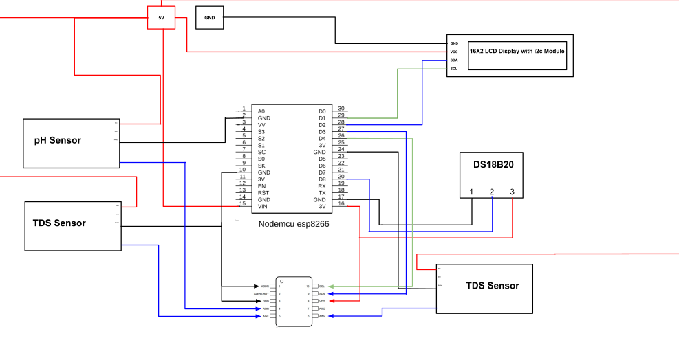

# Water Quality Analyzer Using NodeMCU

An IoT-based real-time water quality monitoring system that measures pH, TDS, Turbidity, and Temperature using ESP8266 NodeMCU.

## Features

- **Real-time monitoring** of 4 water parameters
- **Local display** on 16x2 LCD screen
- **Web dashboard** accessible via WiFi
- **WebSocket communication** for live data updates
- **Portable and cost-effective** design

## Parameters Measured

| Parameter | Sensor | Range |
|-----------|--------|-------|
| pH Level | Analog pH Sensor Kit | 0-14 |
| TDS | TDS Sensor Module | 0-1000 ppm |
| Turbidity | Turbidity Sensor | 0-1000 NTU |
| Temperature | DS18B20 | -55°C to +125°C |

## Hardware Components

- ESP8266 NodeMCU
- ADS1115 16-bit ADC
- 16x2 LCD Display with I2C module
- Analog pH Sensor Kit
- TDS Sensor Module
- Turbidity Sensor
- DS18B20 Temperature Sensor
- Jumper wires and breadboard

## Circuit Diagram



## Installation

### Libraries Required

```cpp
#include <Wire.h>
#include <ADS1X15.h>
#include <LiquidCrystal_I2C.h>
#include <ESP8266WiFi.h>
#include <ESPAsyncWebServer.h>
#include <OneWire.h>
#include <DallasTemperature.h>
```

Install these libraries via Arduino IDE Library Manager.

### Setup

1. Clone this repository
2. Open `water_quality_monitor.ino` in Arduino IDE
3. Update WiFi credentials in the code:
   ```cpp
   const char* ssid = "YOUR_SSID";
   const char* password = "YOUR_PASSWORD";
   ```
4. Upload to ESP8266 NodeMCU
5. Open Serial Monitor to view IP address
6. Access web dashboard at `http://<ESP_IP_ADDRESS>`

## Usage

1. Power the device
2. Wait for WiFi connection (status shown on LCD)
3. View readings on LCD screen locally
4. Access web dashboard from any device on the same network
5. Monitor real-time data with automatic updates every second

## How It Works

The system uses multiple sensors to collect water quality data:

- **pH, TDS, and Turbidity sensors** produce analog signals that are converted to digital values using the ADS1115 16-bit ADC
- **DS18B20 temperature sensor** communicates directly with the ESP8266 via OneWire protocol
- The **ESP8266 NodeMCU** processes all sensor data and displays it on the LCD
- A built-in **web server** hosts a dashboard accessible over WiFi, providing real-time updates via WebSocket

## Applications

- Domestic water purification systems
- Aquaculture and fish farming
- Hydroponics and aquaponics
- Agriculture irrigation monitoring
- Industrial wastewater monitoring
- Drinking water supply in rural areas
- Educational laboratories

## Future Enhancements

- [ ] Cloud data logging (Firebase/ThingSpeak)
- [ ] Mobile app integration
- [ ] SMS/Email alerts for threshold violations
- [ ] Solar-powered operation
- [ ] SD card logging for offline storage
- [ ] Additional sensors (DO, EC, Nitrate)
- [ ] Water Quality Index (WQI) calculation
- [ ] Automatic sensor calibration
- [ ] Multi-user authentication

